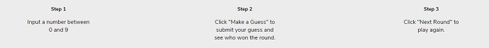

# Number Guesser

Number Guesser is one of Codecademy's open-ended projects that I chose to complete off-platorm in a local text editor. The requirements were to write four JavaScript functions inside of the script.js file to power a small guessing game. We utilized the code provided in the index.html, style.css and game.js files, along with the code that we wrote in script.js to run the game in the browser instead of just the terminal. We also had to use sample inputs to test our functions to make sure that the game would be fully operational.

## Table of Contents

- [Technologies](#technologies)
- [Screenshots](#screenshots)
- [Status](#status)

## Technologies

This project was created with:

- JavaScript ES6
- HTML5
- CSS3

## Screenshots

## Status

This project has been completed.